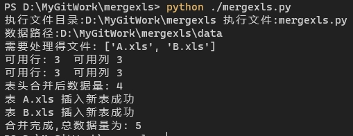

# mergexls 

这是一个合并多个xls文件到一个xls得python项目
默认第一列为表头
根据表头将文件合并到一起
合并A.xls,B.xls如下:
A.xls 
``` 
A	B	C
A1	B1	C1
A2	B2	C2
```
B.xls
```
A	C	D
A3	C3	D3
A4	C4	D4
```
合并后得数据为:
```
A	B	C	D
A1	B1	C1	
A2	B2	C2	
A3		C3	D3
A4		C4	D4
```


## Table of Contents

- [Background](#background)
- [Install](#install)
- [Usage](#usage)
- [License](#license)

## Background

### 从多个系统中导出文件后需要根据表头合并到一个文件中以便于整体查看

## Install

### 依赖项
Python 3.7及以上版本 
依赖 xlwings 模块操作excel(需要系统中带有excel操作软件)

### Python3 下载与安装
[Python3 环境搭建](https://www.runoob.com/python3/python3-install.html)
```
python --version
```
### 初始化 xlwings 模块
```
pip install xlwings
```
## Usage
将需要合并得xls文件放入到源码得data目录
运行mergexls.py
```
python ./mergexls.py
```
运行成功后合并文件在data/save/merge.xls
终端将输出运行结果如:


## License

[MIT](https://github.com/RichardLitt/standard-readme/blob/master/LICENSE) © xiedaibin
